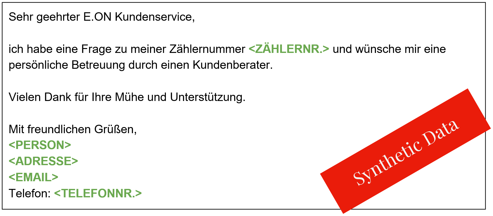
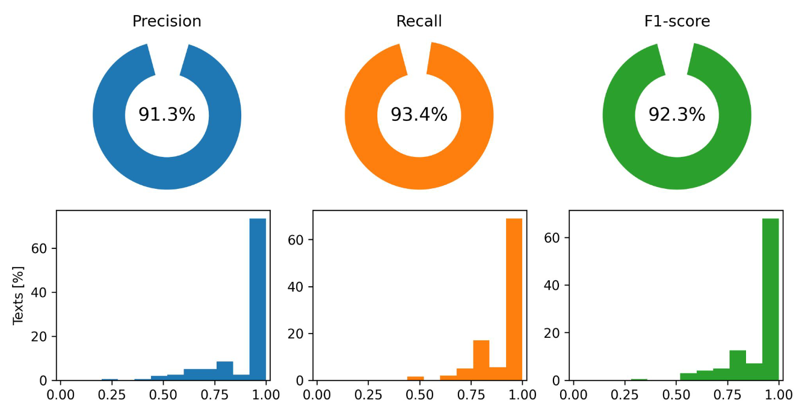
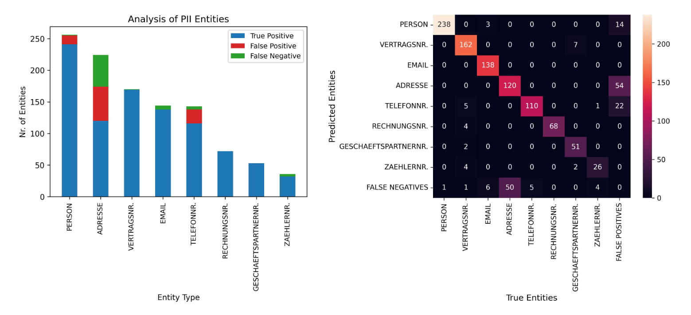

# Anonymizing private information in unstructured data

This repository contains code and data for a capstone project as part of the Constructor Academy Data Science Bootcamp.
The project was provided by the energy provider company E.ON Energie Deutschland.

## Authors

Ammer Georg, Janis Kropp, Thomas Loesekann

## Goal and Approach

The goal of this project was to detect and anonymize personally identifiable information from customer e-mails.
We used three different, complementary approaches to anonymize the texts: Microsoft Presidio, ChatGPT3.5 and Sauerkraut-Mixtral.
Furthermore we built a score_calculator that allows a measurement of the anonymization accuracy of our models.

## Requirements

The requirements and environment files contain information on all the necessary python packages:

paths:

../requirements.txt

../environment.yml

## Data

1000 customer e-mails provided as .txt files. NOTE: These e-mails were synthetically generated and do not contain any private information!

path:

../data/original_texts_renamed

## Labeled Data

We manually labeled 200 randomly selected texts using Azure AI Languague Studio to create a ground truth with which we could evaluate model performaces.
The labels are provided as a .json file:

path:

../data/labels_200_final.json

## Python Scripts

This repo contains 2 python scripts with helper functions for the Presidio model notebook (eon_presidio_model_ga.ipynb) which is called 'helper_functions_presidio.py',
and for the calculate_scores_plot_figures_ga.ipynb notebook which is called 'score_calculator.py'.
These helper scrips need to be imported into the corresponding notebooks.

paths:
	
../src/helper_functions_presidio.py

../src/score_calculator.py

# How to work with this repo

## 1. Run anonymization models
This repo contains individual notebooks for each model (3 in total for: Presidio, GPT, Sauerkraut).
These notebooks take a folder with .txt files as input and create a results dicitionary (predicitions_dict) as output that is then saved as a .json file.
The results dicitionary has the names of the .txt files as keys and a list of results as values:
--> dicitionary {"filename": entity_predicitions} where entity_predicitons is a list that contains a dictionary 
{"start": start character of entity, "stop": stop character of entity, "entitiy_type": type of detected entity} for each detected entity of a text.
Furthermore, the anonymized texts can be saved as individual .txt files.

paths:

../notebooks/eon_presidio_model_ga.ipynb

### $${\color{red}Notebooks \space for \space GPT3.5 \space and \space Sauerkraut \space not \space added \space yet!!!}$$

### Expected Results

## 2. Evaluate model performance
The calculate_scores_plot_figures_ga notebook takes the outputs of the model notebooks (see 1.), that is, the .json files that contain the results dicitionaries
as input and calculates performance scores, entity-based analysis and a confusion matrix and also generates several plots of these analyses.
The heart of this analyses is the calculate_model_score function that is defined in the score_calculator script. It takes two results dicitionaries and then compares
the results (i.e. the predicted entities) between them. First, the dictionaries are matched by the keys, such that the predicitions for the same texts are compared.
In case one of the input dicitionaries (e.g. labels_dict) has fewer results than the other (e.g. because not all texts were labeled)
than this dict has to be passed as the second argument (labels_or_model_dict), otherwise a key error might occur.
The input to the calculate_model_score function can be any dictionary that has the correct format. This can be predicitions from a model, ground truth from labeled data
or the combined predictions of 2 or more models (i.e. only those predicitions where all models agree). 
The results of the calculate_model_score function can be saved as dicitionaries (metrics_dict_all, score_dict_all) in .json format.
The plots can be saved as .png files.

path:

../notebooks/calculate_scores_plot_figures_ga.ipynb	

### Expected Results

Model performance for Microsoft Presidio model evaluated on 200 labeled texts.

Entity based analysis and confusion matrix for Microsoft Presidio model evaluated on 200 labeled texts.

